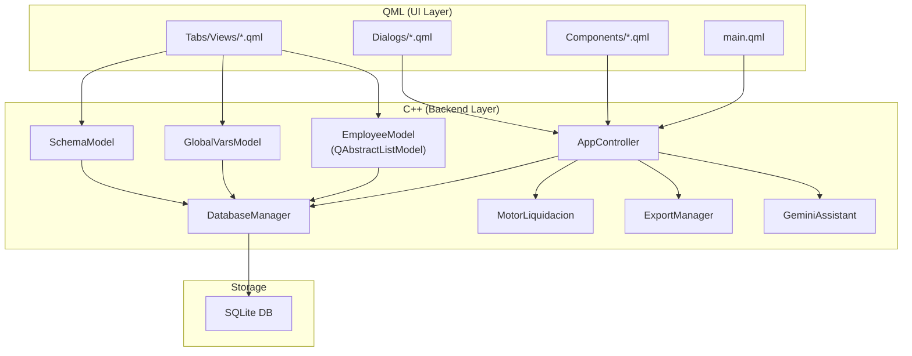

# Migración del Sistema de Liquidación de Sueldos a C++ / QML

## Contexto y Análisis del Proyecto Actual

El sistema actual es una aplicación PyQt6 (~9,400 líneas) de liquidación de sueldos con:

| Archivo | Líneas | Responsabilidad |
|---------|--------|----------------|
| [ui.py](file:///home/franco/Proyectos/liquidacion-sueldo/ui.py) | 5,536 | **TODO**: UI, lógica de negocio, formateo, exportación, diálogos |
| [database.py](file:///home/franco/Proyectos/liquidacion-sueldo/database.py) | 1,401 | CRUD SQLite + migraciones + propagación de variables |
| [exporters.py](file:///home/franco/Proyectos/liquidacion-sueldo/exporters.py) | 1,264 | Export/Import PDF, Excel, ODS, CSV |
| [motor.py](file:///home/franco/Proyectos/liquidacion-sueldo/motor.py) | 609 | Motor de cálculo con simpleeval |
| [gemini_assistant.py](file:///home/franco/Proyectos/liquidacion-sueldo/gemini_assistant.py) | 549 | Integración con Gemini API (function calling) |

---

## Decisiones de Diseño Cuestionables (Análisis Crítico)

### 🔴 Problemas Graves

1. **`ui.py` es un God Object de 5,500 líneas** — `MainWindow` contiene TODA la lógica de la app: validación de formularios, lógica de modo admin/usuario, formateo de moneda, exportación de archivos, lógica de quincenas, y la construcción de 13 tabs monolíticas. Esto viola SRP completamente.

2. **Variables de empleado almacenadas como JSON blob** — `variables_calculo TEXT` guarda un JSON libre con estructura `{quincenas: {Q1: {...}, Q2: {...}}}`. Esto hace imposible validar integridad, indexar, o hacer queries SQL sobre variables individuales. Cada operación CRUD requiere parsear/serializar JSON manualmente.

3. **`adaptar_variables_a_esquema` y `propagar_variables_esquema` son excesivamente complicados** — ~200 líneas de lógica defensiva para sincronizar JSONs entre empleados cuando se modifica un esquema. Esto es un síntoma directo del problema #2.

4. **Motor de cálculo usa `simpleeval` con Python `eval`-like** — Funciona, pero es inherentemente inseguro y difícil de portar a C++. Las fórmulas son strings Python evaluadas al vuelo.

5. **El sistema de roles (Admin/Usuario) se implementa ocultando/mostrando widgets** — No hay un sistema de permisos real. Se cambia la visibilidad de tabs y botones en `_actualizar_modo_vista()` con ~70 líneas de `setVisible(True/False)`.

### 🟡 Problemas Moderados

6. **Gráfico de torta usa matplotlib embebido** — Funciona pero agrega una dependencia pesada solo para un pie chart. En QML se puede usar `ChartView` nativo.

7. **Las exportaciones PDF usan HTML renderizado con QPrinter** — Un approach frágil. Sería mejor usar una librería dedicada o templates.

8. **Gemini Assistant hace HTTP directo con urllib** — Sin manejo de rate limits, sin streaming, sin retry logic.

9. **Seed data hardcodeada** — Los datos iniciales del sistema (esquemas MENSUAL/JORNAL, empleados de prueba) están hardcodeados en `_seed_datos_iniciales()` de 130+ líneas.

---

## Arquitectura Propuesta (C++ + QML)

### Principio Fundamental: **Separación Estricta UI/Lógica**



---

## Proposed Changes

### Component 1: Proyecto CMake y estructura de directorios

#### [NEW] `CMakeLists.txt`
Proyecto Qt6 con módulos: Quick, Sql, Charts, HttpServer (para Gemini). Configuración de QML module y recursos.

#### [NEW] Estructura de directorios:
```
liquidacion-sueldo-qml/
├── CMakeLists.txt
├── src/
│   ├── main.cpp
│   ├── database/
│   │   ├── DatabaseManager.h/.cpp      # Gestión SQLite con QSqlDatabase
│   │   └── Migrations.h/.cpp           # Migraciones y seeds separadas
│   ├── models/
│   │   ├── EmployeeModel.h/.cpp        # QAbstractListModel para lista de empleados
│   │   ├── EmployeeVarsModel.h/.cpp    # Modelo para variables dinámicas
│   │   ├── GlobalVarsModel.h/.cpp      # Modelo para variables globales
│   │   ├── SchemaModel.h/.cpp          # Modelo para esquemas de cálculo
│   │   ├── SectionModel.h/.cpp         # Modelo para secciones
│   │   ├── CategoryModel.h/.cpp        # Modelo para categorías jornaleras
│   │   ├── CellModel.h/.cpp            # Modelo para celdas de cálculo
│   │   ├── ChartCellModel.h/.cpp       # Modelo para celdas de gráfico
│   │   └── ReceiptHistoryModel.h/.cpp  # Modelo para historial de recibos
│   ├── engine/
│   │   ├── FormulaEngine.h/.cpp        # Motor de evaluación de fórmulas
│   │   ├── LiquidationEngine.h/.cpp    # Orquestador de liquidación
│   │   └── QuincenaAggregator.h/.cpp   # Lógica de agregación quincenal
│   ├── services/
│   │   ├── ExportService.h/.cpp        # Exportación PDF/Excel/ODS/CSV
│   │   ├── ImportService.h/.cpp        # Importación de datos
│   │   ├── BackupService.h/.cpp        # Backup y Nuevo Mes
│   │   └── GeminiService.h/.cpp        # Integración con Gemini API
│   └── controllers/
│       └── AppController.h/.cpp        # Fachada principal expuesta a QML
├── qml/
│   ├── main.qml                        # Ventana principal + TabBar
│   ├── views/
│   │   ├── EmployeesView.qml           # Tab Empleados
│   │   ├── CompanyView.qml             # Tab Empresa
│   │   ├── CategoriesView.qml          # Tab Categorías Jornal
│   │   ├── SchemasView.qml             # Tab Esquemas de Cálculo
│   │   ├── SectionsView.qml            # Tab Secciones
│   │   ├── GlobalVarsView.qml          # Tab Campos Globales
│   │   ├── ReceiptStructureView.qml    # Tab Estructura del Recibo
│   │   ├── SchemaVisualView.qml        # Tab Esquema Visual
│   │   ├── ChartConfigView.qml         # Tab Estructura del Gráfico
│   │   ├── PreviewView.qml             # Tab Vista Previa
│   │   ├── ReceiptHistoryView.qml      # Tab Historial de Recibos
│   │   ├── FormulaConsoleView.qml      # Tab Consola de Fórmulas
│   │   └── AiAssistantView.qml         # Tab Asistente IA
│   ├── components/
│   │   ├── MoneyField.qml              # Campo con formato moneda
│   │   ├── PercentageField.qml         # Campo con formato porcentaje
│   │   ├── VariableEditor.qml          # Editor de variables dinámicas
│   │   ├── QuincenaTabBar.qml          # Tabs de quincenas
│   │   ├── RoleSelector.qml            # Selector Admin/Usuario
│   │   ├── PieChart.qml                # Gráfico de torta (Qt Charts)
│   │   └── ResultTree.qml              # Árbol de resultados de liquidación
│   └── dialogs/
│       ├── ConceptDialog.qml           # Dialog para agregar/editar conceptos
│       ├── VariableAssistantDialog.qml # Asistente de variables
│       ├── MassExportDialog.qml        # Exportación masiva PDF
│       ├── SchemaConfigDialog.qml      # Configurar esquema
│       └── SettingsDialog.qml          # Configuración general
└── resources/
    └── resources.qrc
```

---

### Component 2: Base de Datos (`database/`)

#### [NEW] `DatabaseManager.h/.cpp`
- Reescritura usando **QSqlDatabase** + **QSqlQuery** en vez de sqlite3 raw.
- Patrón Singleton thread-safe para la conexión.
- Las mismas tablas del sistema actual (esquemas, categorías, secciones, empleados, celdas_calculo, celdas_grafico, variables_globales, empresa, recibos, configuraciones).
- **Mejora clave**: El JSON blob de `variables_calculo` se mantiene (es la naturaleza dinámica del sistema), pero toda la lógica de `adaptar_variables_a_esquema` y `propagar_variables_esquema` se simplifica usando `QJsonDocument` y helpers más limpios.

#### [NEW] `Migrations.h/.cpp`
- Migraciones y seed data extraídas a un archivo dedicado en vez de estar embebidas en el constructor del DatabaseManager.

---

### Component 3: Modelos Qt (`models/`)

En vez del approach actual donde `MainWindow` hace fetch directo de la DB y rellena `QTableWidget` manualmente, usaremos **modelos Qt reales** que QML consume con data binding:

#### [NEW] `EmployeeModel.h/.cpp` (hereda `QAbstractListModel`)
- Roles: `LegajoRole`, `NombreRole`, `TipoLiquidacionRole`, `EsquemaRole`, `CategoriaRole`, `FechaIngresoRole`, `CuilRole`
- Métodos Q_INVOKABLE: `addEmployee()`, `removeEmployee(int index)`, `duplicateEmployee(int index)`, `saveEmployee(int index, ...)`
- Señales para notificar cambios a la vista.

#### [NEW] `EmployeeVarsModel.h/.cpp`
- Modelo especializado para las variables dinámicas de un empleado específico.
- Maneja la complejidad de quincenas internamente.
- Expone una interfaz limpia: `key`, `value`, `type` (bool/number/string).

#### [NEW] Modelos análogos para:
- `GlobalVarsModel` — variables globales editables
- `SchemaModel` — esquemas de cálculo
- `SectionModel` — secciones del recibo
- `CategoryModel` — categorías jornaleras
- `CellModel` — celdas de cálculo (filtrable por esquema)
- `ChartCellModel` — celdas de gráfico
- `ReceiptHistoryModel` — historial de recibos

---

### Component 4: Motor de Cálculo (`engine/`)

#### [NEW] `FormulaEngine.h/.cpp`
- **Decisión clave**: Reemplazar `simpleeval` de Python con un evaluador de expresiones en C++.
- Opciones evaluadas:
  - **exprtk** (header-only, alta performance, muy completo) ← **Recomendado**
  - **muParser** (maduro, usado en producción)
  - QJSEngine (motor JS de Qt, más flexible pero más lento)
- Soporte para: variables numéricas, booleanas, funciones custom (`round`, `max`, `min`, `abs`, `sumar_q`, `promedio_q`, etc.).
- Registra funciones de agregación quincenal y funciones históricas.

#### [NEW] `LiquidationEngine.h/.cpp`
- Port directo de `MotorLiquidacion.procesar_liquidacion()` a C++.
- Misma secuencia: inyectar globals → inyectar vars empleado → pre-computar quincenas → evaluar celdas → generar resultado.
- Retorna un `QVariantMap` consumible desde QML.

#### [NEW] `QuincenaAggregator.h/.cpp`
- Encapsula toda la lógica de Q_sum_, Q_avg_, Q_max_, Q_min_ y cant_q().
- Separada del motor principal para claridad.

---

### Component 5: Servicios (`services/`)

#### [NEW] `ExportService.h/.cpp`
- Port de las funciones de [exporters.py](file:///home/franco/Proyectos/liquidacion-sueldo/exporters.py).
- PDF: Usar **QPdfWriter** + **QPainter** (mucho más control que el approach HTML actual).
- Excel: Usar **QXlsx** (librería Qt para xlsx) o libxlsxwriter.
- CSV: QTextStream directo.
- ODS: Se puede portar o evaluar si realmente se usa (considerar eliminar si no).

#### [NEW] `ImportService.h/.cpp`
- Port de la importación Excel/CSV.

#### [NEW] `BackupService.h/.cpp`
- Lógica de `crear_backup()` y `reinicializar_nuevo_mes()`.

#### [NEW] `GeminiService.h/.cpp`
- Port de [gemini_assistant.py](file:///home/franco/Proyectos/liquidacion-sueldo/gemini_assistant.py) usando **QNetworkAccessManager**.
- Mejora: agregar retry logic, timeout handling, y streaming response.

---

### Component 6: Controlador (`controllers/`)

#### [NEW] `AppController.h/.cpp`
- Fachada principal expuesta a QML como context property.
- Coordina DatabaseManager, modelos, engine y servicios.
- Gestiona el modo Admin/Usuario con una property `currentRole` que QML usa para binding de visibilidad.
- Q_PROPERTY para: `currentRole`, `currentEmployee`, `lastLiquidationResult`, `debugMode`.
- Q_INVOKABLE para: `calculateLiquidation()`, `exportPdf()`, `massExportPdf()`, `newMonth()`, `switchRole()`, etc.

---

### Component 7: QML UI (`qml/`)

#### [NEW] `main.qml`
- Ventana principal con **TabBar** + **StackLayout** (o SwipeView).
- Binding a `AppController.currentRole` para mostrar/ocultar tabs.
- MenuBar con acciones de importación/exportación.
- Sin lógica de negocio: solo layout, bindings, y llamadas a Q_INVOKABLE.

#### [NEW] Views (13 archivos `.qml`)
Cada tab es un archivo QML independiente que consume su modelo correspondiente:

| Vista | Modelo C++ que consume |
|-------|----------------------|
| `EmployeesView.qml` | `EmployeeModel`, `EmployeeVarsModel` |
| `CompanyView.qml` | Propiedades directas de `AppController` |
| `CategoriesView.qml` | `CategoryModel` |
| `SchemasView.qml` | `SchemaModel` |
| `SectionsView.qml` | `SectionModel` |
| `GlobalVarsView.qml` | `GlobalVarsModel` |
| `ReceiptStructureView.qml` | `CellModel` |
| `SchemaVisualView.qml` | `CellModel` (filtrado) |
| `ChartConfigView.qml` | `ChartCellModel` |
| `PreviewView.qml` | Resultado de `LiquidationEngine` |
| `ReceiptHistoryView.qml` | `ReceiptHistoryModel` |
| `FormulaConsoleView.qml` | `FormulaEngine` directo |
| `AiAssistantView.qml` | `GeminiService` |

#### [NEW] Components reutilizables
- `MoneyField.qml` — TextField con validación y formato de moneda argentina.
- `PercentageField.qml` — TextField con formato porcentaje.
- `VariableEditor.qml` — Editor dinámico de variables (checkboxes para bool, spinboxes para números).
- `QuincenaTabBar.qml` — TabBar para navegar quincenas.
- `RoleSelector.qml` — ComboBox Admin/Usuario.
- `PieChart.qml` — Gráfico de torta usando Qt Charts QML.
- `ResultTree.qml` — TreeView para resultados de liquidación.

---

## User Review Required

> [!IMPORTANT]
> **Evaluador de fórmulas**: El motor actual usa `simpleeval` (Python). En C++ propongo usar **exprtk** (header-only, ~1MB header, excelente performance). Las fórmulas existentes del usuario son expresiones simples (`basico * 0.01`, `round(x + y, 2)`) que son compatibles. ¿Te parece bien o preferís QJSEngine (motor JavaScript) que sería más flexible pero más lento?

> [!IMPORTANT]
> **Export a Excel**: En Python se usa `openpyxl`. En C++ propongo **QXlsx** (librería Qt open-source). Otra opción es `libxlsxwriter` (C puro, más maduro). ¿Preferencia?

> [!WARNING]
> **ODS (LibreOffice)**: El soporte ODS actual usa `odfpy`. Portarlo a C++ requiere una librería adicional o generar XML manualmente. ¿Se usa realmente el export a ODS o se puede eliminar?

> [!WARNING]
> **Gemini Assistant**: El asistente IA con function calling es una feature compleja. ¿Lo portamos en esta primera fase o lo dejamos para después?

## Open Questions

1. **¿Querés mantener la compatibilidad con la base de datos SQLite actual?** Es decir, que la nueva app C++/QML pueda abrir la misma `liquidacion_sueldos.db` sin migración.

2. **¿Querés hacer la migración in-place (reemplazar los archivos Python) o crear un directorio nuevo** (ej: `liquidacion-sueldo-qml/`)?

3. **¿Tenés Qt6 instalado con los módulos necesarios?** Necesitamos al menos: `Qt6::Quick`, `Qt6::Sql`, `Qt6::Charts`. Puedo ayudarte a instalarlo si no.

4. **¿Hay alguna funcionalidad del sistema actual que quieras eliminar o simplificar** en esta reescritura? (Por ejemplo, el export a ODS, el Gemini Assistant, el modo debug visual).

5. **¿Querés que el gráfico de torta use Qt Charts (nativo QML) o preferís otra visualización** como un bar chart?

---

## Verification Plan

### Automated Tests
- Test unitarios con **QTest** para: `DatabaseManager`, `FormulaEngine`, `LiquidationEngine`.
- Test de integración: abrir la DB existente, calcular liquidación, comparar resultados con los del motor Python actual.

### Manual Verification
- Compilar y ejecutar con `cmake --build . && ./liquidacion_sueldos`.
- Verificar que cada tab funcione y se vea correctamente.
- Comparar una liquidación calculada en ambas versiones (Python vs C++) para validar exactitud numérica.
- Verificar exportación PDF/Excel.

---

## Estimación de Esfuerzo

| Fase | Componentes | Complejidad |
|------|-------------|-------------|
| 1. Scaffold + DB + Modelos básicos | CMakeLists, DatabaseManager, EmployeeModel, main.qml | Media |
| 2. Motor de cálculo | FormulaEngine, LiquidationEngine, QuincenaAggregator | Alta |
| 3. Todas las vistas QML | 13 views + components + dialogs | Alta (volumen) |
| 4. Exportación/Importación | ExportService, ImportService | Media |
| 5. Features avanzadas | GeminiService, BackupService, Console | Media-Alta |
| 6. Testing y polish | QTest, comparación cross-platform | Media |

> [!NOTE]
> Este es un proyecto sustancial. Recomiendo trabajar por fases, empezando por la Fase 1+2 que establece la base funcional, y luego ir construyendo las vistas tab por tab.
